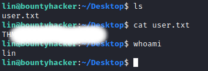

# THM BountyHunter [room](https://tryhackme.com/room/cowboyhacker) writeup.
First of all let's, of course, nmap the machine, an aggressive scan will get us everything we need.

> nmap -A [target_machine_ip]

We can see tre opened ports - ftp, ssh and http. Also note that we can login to the ftp service as Anonymous, we'll check that later. Let's see if we can find something on the website.

Nothing usefull about getting into ssh nor information about flags, also the source code doesn't hide anything, it even seems pointless to run gobuster, let's directly jump to the ftp service.

> ftp [machine_target_ip]

Well, now it's getting interesting let's download those files to our machine so we can read them.

> get [filename]

After checking those files we get the answer to the 3rd question, and potentialy a username, while the other file seems like a seclist which we can use to bruteforce into the ssh using hydra.

> hydra -l username -P passwordsfile [target_ip] ssh

The bruteforce wont take long since the wordlist that we stole is pretty short.

Now let's use those to ssh into the target machine!

> ssh username@ip

Now we're in and we got the user flag! But right away we need to find a way to escalate. We could actually set up a python server to run linpeas or LinEnum but considering that it's an easy box checking manually for basic things like environment variables, sudo rights, or cronjobs will get us something.

Usually i like to start with sudo rights:

> sudo -l

What's that?! We got some sudo rights on tar, now it looks like a job for GTFOBins, let's check that.

And that's exactly what we needed.

Well, our job here is done. For any questions/typos contact me on discord Skull#3228.

